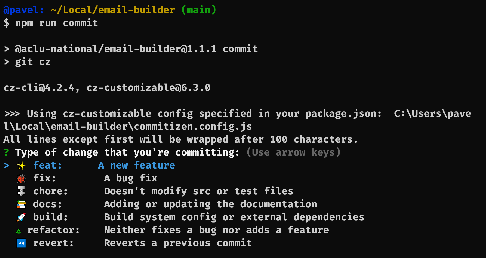
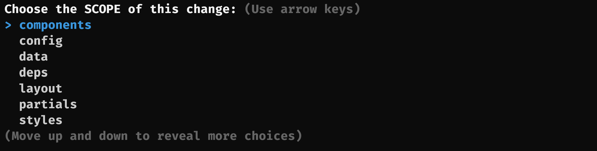
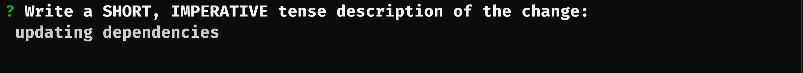
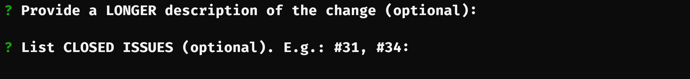
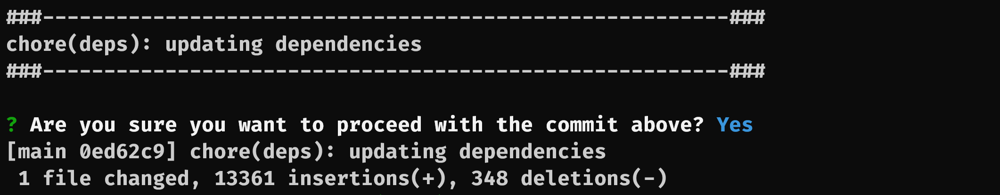

# Commit

> Commits are a snapshot in time, not diffs! [**GitHub Blog**](https://github.blog/2020-12-17-commits-are-snapshots-not-diffs/)

It is recommended to commit often. Git only takes full responsibility for your data when you commit. The more code you have per commit the harder it is to drill down into what the issue might be.

This package follows [`conventional commits`](https://www.conventionalcommits.org/en/v1.0.0/) and [`semver`](https://semver.org/) conventions. For this we have to follow a specific commit message.

This package is using [`commitlint`](https://github.com/conventional-changelog/commitlint) and [`commitizen`](https://github.com/commitizen/cz-cli) to adhere to those conventions.

## Instructions

> **Note:** Commit often and keep your commit in scope. Don't use `git add .` when you have a mixture of files fixing different issues.
>
> _**example:** standard.html changing styles and event.html change footer layout._

Stage files in small pieces.

```
git add file-name.md
```

While the git next step is to normally run `git commit -m "message"`, we are taking a different approach to pull up a `commitizen` cli interface.

```
npm run commit
```

### Commitizen

The following questions are either select options or plain text. Formatting is handled by the tool.

> **Note:** (\*) denotes question is required

1. `Type of change that you're committing:` (\*)
   
   <br />
2. `Choose the SCOPE of this change:`
   
   <br />
3. `Write a SHORT, IMPERATIVE tense description of the change:`
   
   <br />
4. `Provide a LONGER description of the change (optional):`

5. `List CLOSED ISSUES (optional). E.g.: #31, #34:`
   
   <br />
6. `Are you sure you want to proceed with the commit above?`
   
