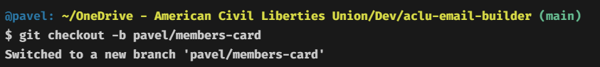

# How to Use

> Before you start push any code to remote, make sure there is already a ticket filed and discussion started.

Once you have a ticket that you are going to work on, you can now create a local branch.

```
git checkout -b your-name/component-name
```



## Create Working file

Now we can create the file you'll be using to build and test your component.

Create a file in the `templates/components` directory. You want to follow the naming convention of `initials-component-name.{html|njk|md}`. The file type you use is completely up to you.

You'll need to add this to the top of your file, no matter what file type you are working with.

<!-- prettier-ignore-start -->
```
---
component: Members Card
---
```
<!-- prettier-ignore-end -->

you can also fill out this lorem ipsum to give some text to the page but it is not required.

<!-- prettier-ignore-start -->
```
<p>Lorem ipsum dolor sit, amet consectetur adipisicing elit. Provident facilis esse possimus harum in! Quis qui suscipit rerum aut, dolore itaque deserunt ipsa voluptatibus corrupti maiores mollitia eius. Quas, sequi.</p>

<p>Excepturi explicabo perspiciatis nostrum dolores libero mollitia dolore suscipit repellendus! Perspiciatis veniam aliquam officiis beatae illum quae architecto ad nulla quidem totam, pariatur consequatur, saepe quos placeat sed nemo repellat!</p>

<p>Quam inventore magni impedit in et incidunt ad dolorem praesentium cupiditate quasi repudiandae, nulla eligendi est aspernatur? Aliquam laboriosam, adipisci omnis, distinctio quisquam nemo veritatis saepe minima deleniti, nam et.</p>

```
<!-- prettier-ignore-end -->

#### Creating the component

You can use the snippet `table-wrap` to display a starting table that adheres to our styles. This makes it simple for you to get prototyping quicker on layout.

<!-- prettier-ignore-start -->
```
code-wrap
```
<!-- prettier-ignore-end -->

will display this

<!-- prettier-ignore-start -->
```html
<table role="presentation" align="center" border="0" cellpadding="0" cellspacing="0" class="email-wrapper" width="{{theme.width}}" style="margin-bottom: 15px;">
	<tbody>
		<tr>
			<td style="
			color: {{theme.light.color}};
			font-family: {{theme.text.fontFamily}};
			font-size: {{theme.text.fontSize}};
			line-height: {{theme.text.lineHeight}};
			padding: {{theme.padding}};" valign="top">
				<h4>Membership Card</h4>
				<p>Member Name: Pavel</p>
				<p>Member ID: 8675309</p>
				<p>Member Since: 1920</p>
			</td>
		</tr>
	</tbody>
</table>
```
<!-- prettier-ignore-end -->

#### Committing the Change

Refer to [**commit.md**](commit.md) for steps on how to commit.

#### Push to remote

Refer to [**push.md**](push.md) for steps on how to push the commit to remote.
