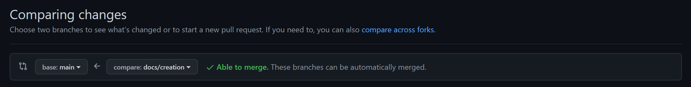

# Pull Request

Pull Request (PR) are useful for implementing code reviews and running checks on the code before merging onto the main branch.

While PR are not a native feature of git &ndash; they are added by the remote repositories (Github, Gitlab, BitBucket). Each service handles them differently.

Pull request should merge the working branch to `main`.

## Reviews

1. Clone the repo `git clone https://github.com/aclu-national/email-builder.git`
2. Move into the directory with `cd email-builder`.
3. Change the branch for the PR.
4. Install all packages with `npm install`.
5. Build the templates with `npm run build`.
6. Go into the `dist/templates/base` for a built templates to test
7. Head over to [**Sailthru**](https://my.sailthru.com/#rev/today) and changed to the `ACLU-Dev` environment.
8. In the campaigns section, find the campaign `24XXXX NAT GradeAD Template Test`.
9. If everything looks good, you can finally approve the PR changes.

## Merging

We will be using `squash` to merge PRs. This compresses all commits pushed to that PR into a singular commit in the git history. This is useful when making smaller commits that all fix the same issue.

This means that PR names will have to follow `Conventional Commits` as well. So keep your PR changes smaller as they are easier to code review.
